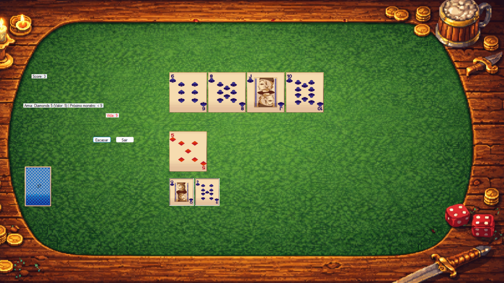

# 🃏 Scoundrel Dungeon

Um jogo de cartas roguelike inspirado no clássico **Scoundrel**, reimaginado como uma exploração de dungeon. Enfrente monstros, gerencie sua vida, encontre armas e poções, e tente sobreviver até o fim do baralho.

Desenvolvido em **C# com Windows Forms**.

##  Sobre o projeto

Neste projeto, me desafiei a criar um dos meus primeiros jogos utilizando C# e Windows Forms. Na época, meu principal objetivo era aprender na prática e conseguir levar o projeto até o fim, então optei por manter a implementação simples, sem me preocupar excessivamente com arquitetura, padrões de projeto ou com todas as boas práticas que hoje eu considero importantes.

O projeto foi desenvolvido durante meu primeiro semestre da faculdade, quando minha experiência com programação ainda era bastante limitada. Durante o desenvolvimento, encontrei algumas dificuldades que estavam além do meu nível de conhecimento naquele momento, principalmente ao trabalhar com recursos como áudio, gerenciamento de arquivos e recursos, eventos da interface e diferentes bibliotecas e imports.

Agora, no 3º semestre, tenho uma compreensão muito maior de conceitos como Programação Orientada a Objetos, encapsulamento, abstração, estruturas de dados, separação de responsabilidades, gerenciamento de estado e arquitetura de aplicações. Por isso, decidi continuar evoluindo o projeto, refatorando partes do código e implementando algumas das ideias e funcionalidades que surgiram desde sua criação.

Ainda assim, a intenção não é transformar o Scoundrel Dungeon em um projeto enorme. Quero mantê-lo relativamente pequeno, como um registro da minha evolução e uma lembrança de uma das primeiras etapas da minha trajetória como desenvolvedor.

##  Screenshots

<p align="center">
  
  
</p>

##  Vídeo

<p align="center">
  <a href="https://www.youtube.com/watch?v=bKyTffIF03A">
    
  </a>
</p>

##  Como jogar

- A cada sala, 4 cartas são reveladas na mesa
- **♦ Ouros** — equipa uma arma (a arma anterior é descartada)
- **♥ Copas** — usa uma poção de cura (limite de 1 por sala)
- **♣ Paus / ♠ Espadas** — monstros: causam dano igual ao valor da carta, a menos que você tenha uma arma equipada capaz de enfrentá-lo
- Escolha 3 das 4 cartas por sala; a 4ª carta permanece para a próxima rodada
- **Fugir** só é permitido se você ainda não escolheu nenhuma carta na sala, e não pode fugir duas rodadas seguidas
- O objetivo é esvaziar o baralho e a mesa sem que sua vida chegue a zero

##  Mecânicas principais

- Sistema de arma com durabilidade baseada em regra original do Scoundrel (só pode enfrentar monstros de valor decrescente)
- Histórico visual dos últimos monstros derrotados pela arma atual
- Sistema de poção limitado por sala
- Efeitos visuais (piscar de vida) e sonoros para dano, cura, fuga e quebra de equipamento
- Sistema de pontuação (score) por carta resolvida

##  Tecnologias

- C#
- Windows Forms
- System.Media (efeitos sonoros)

##  Roadmap

- [ ] Refatorar arquitetura para Orientação a Objetos (separar regras de jogo da interface)
- [ ] Substituir imagens placeholder por pixel art
- [ ] Aprimorar os efeitos sonoros e artes visuais em geral do projeto
- [ ] Adicionar painel de dicas
- [ ] Adicionar painel de "Como jogar"
- [ ] Novos tipos de sala
- [ ] Novos Bosses como cartas de valor alto

##  Como rodar

1. Clone o repositório:
```bash
   git clone https://github.com/Victor-Harger/Scoundrel-Dungeon.git
```
2. Abra o arquivo `.sln` no Visual Studio
3. Compile e execute (F5)
