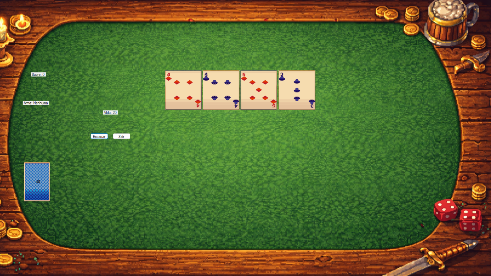

# 🃏 Scoundrel Dungeon

Um jogo de cartas roguelike inspirado no clássico **Scoundrel**, reimaginado como uma exploração de dungeon. Enfrente monstros, gerencie sua vida, encontre armas e poções, e tente sobreviver até o fim do baralho.

Desenvolvido em **C# com Windows Forms**.

## 📸 Screenshots

<!-- Coloque suas imagens na pasta /screenshots e referencie aqui -->


[](https://www.youtube.com/watch?v=bKyTffIF03A)

## 🎮 Como jogar

- A cada sala, 4 cartas são reveladas na mesa
- **♦ Ouros** — equipa uma arma (a arma anterior é descartada)
- **♥ Copas** — usa uma poção de cura (limite de 1 por sala)
- **♣ Paus / ♠ Espadas** — monstros: causam dano igual ao valor da carta, a menos que você tenha uma arma equipada capaz de enfrentá-lo
- Escolha 3 das 4 cartas por sala; a 4ª carta permanece para a próxima rodada
- **Fugir** só é permitido se você ainda não escolheu nenhuma carta na sala, e não pode fugir duas rodadas seguidas
- O objetivo é esvaziar o baralho e a mesa sem que sua vida chegue a zero

## ⚔️ Mecânicas principais

- Sistema de arma com durabilidade baseada em regra original do Scoundrel (só pode enfrentar monstros de valor decrescente)
- Histórico visual dos últimos monstros derrotados pela arma atual
- Sistema de poção limitado por sala
- Efeitos visuais (piscar de vida) e sonoros para dano, cura, fuga e quebra de equipamento
- Sistema de pontuação (score) por carta resolvida

## 🛠️ Tecnologias

- C#
- Windows Forms
- System.Media (efeitos sonoros)

## 🚧 Roadmap

- [ ] Refatorar arquitetura para Orientação a Objetos (separar regras de jogo da interface)
- [ ] Substituir imagens placeholder por pixel art autoral das criaturas
- [ ] Adicionar painel de dicas
- [ ] Adicionar painel de "Como jogar"
- [ ] Novos tipos de sala/eventos de dungeon

## ▶️ Como rodar

1. Clone o repositório:
```bash
   git clone https://github.com/Victor-Harger/Scoundrel-Dungeon.git
```
2. Abra o arquivo `.sln` no Visual Studio
3. Compile e execute (F5)

## 📄 Licença

<!-- Escolha uma licença se quiser (MIT é comum para projetos pessoais) -->
